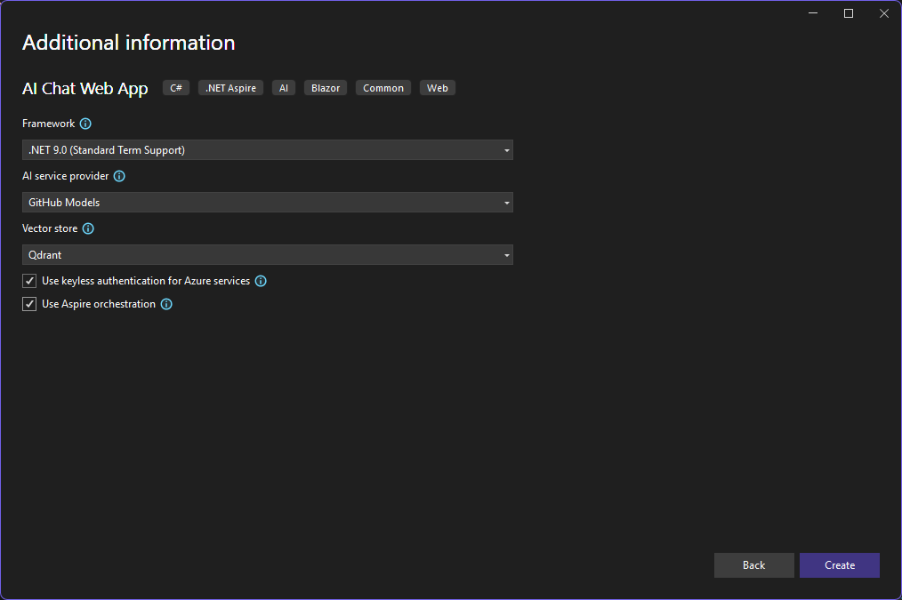

# Create a new project using the AI Web Chat template

## In this lab

In this lab, you'll create a new project using the AI Web Chat template in Visual Studio. You'll configure GitHub Models as the AI service provider, set up the connection string, and run and explore the application.

## Create the project using Visual Studio

Create a new project using the AI Web Chat template as follows:

1. Open Visual Studio 2022
1. Click "Create a new project"
1. Search for and select "AI Chat Web App" template

   

1. Click "Next"
1. Configure your project:
   - Enter "GenAiLab" as the project name
   - Choose a location for your project
   - Make sure "Place solution and project in same directory" is checked
   - Click "Next"

   

1. Configure AI options:
   - Select "GitHub Models" for AI service provider
   - Select "Qdrant" for Vector store
   - Check the box for "Use Aspire orchestration"
   - Click "Create"

   

1. Wait for Visual Studio to create the project and restore packages. When you see the Sign in popup, just close it.

## Set the GitHub Models connection string

For GitHub Models to work, you need to set up a connection string with a GitHub token:

1. Create a GitHub token for accessing GitHub Models:
   - Go to [https://github.com/settings/tokens](https://github.com/settings/tokens)
   - Click "Generate new token (classic)"
   - Give the token a description like "AI Models Access"
   - Select the "github_models:read" scope
   - Click "Generate token"
   - Copy the generated token (you won't be able to see it again)

1. In the Solution Explorer, right-click on the `GenAiLab.AppHost` project and select "Manage User Secrets"

1. In the `secrets.json` file that opens, add the following connection string:

   ```json
   {
     "ConnectionStrings:openai": "Endpoint=https://models.inference.ai.azure.com;Key=YOUR-API-KEY"
   }
   ```

   Replace `YOUR-GITHUB-TOKEN` with the GitHub token you created in step 1.

1. Save the `secrets.json` file.

## Run the application

Now let's run the application and explore its features:

1. Make sure the `GenAiLab.AppHost` project is set as the startup project.

1. Press F5 or click the "Start Debugging" button in Visual Studio.

1. The .NET Aspire dashboard will open in your browser first, displaying all the services in your application.

1. Shortly after, the web application will launch in another browser tab.

## Review the services in the .NET Aspire dashboard

Explore the .NET Aspire dashboard to understand the architecture of your application:

1. You'll see several services running:
   - `aichatweb-app`: The main web application
   - `vectordb`: The Qdrant vector database service
   - `ingestionCache`: SQLite database for caching ingestion state

1. Click on each service to see more details:
   - Explore the endpoints tab to see service URLs
   - Check the logs tab to monitor service activity
   - View the environment variables to understand service configuration

1. Notice how .NET Aspire orchestrates all these services together, making it easy to develop distributed applications.

## Test the application

Let's test the AI functionality of the application:

1. In the web application tab, you'll see a chat interface.

1. Type a message like "What PDF documents do you have information about?" and press Enter.

1. The AI will respond with information about the PDF documents that have been ingested.

1. Ask another question like "Tell me about survival kits" and observe how the AI uses information from the ingested documents to provide a response.

1. Notice how the chat history is maintained and displayed on the left sidebar.

## What You've Learned

- How to create a new project using the AI Web Chat template in Visual Studio
- How to configure GitHub Models as the AI service provider
- How to set up the connection string for AI services
- How to use .NET Aspire to orchestrate multiple services
- How to interact with an AI-powered chat application

## Next Steps

Now that you've created and run your AI Web Chat application, proceed to [Explore the Template Code](part2-explore-template.md) to understand the underlying architecture and code structure of the application.
